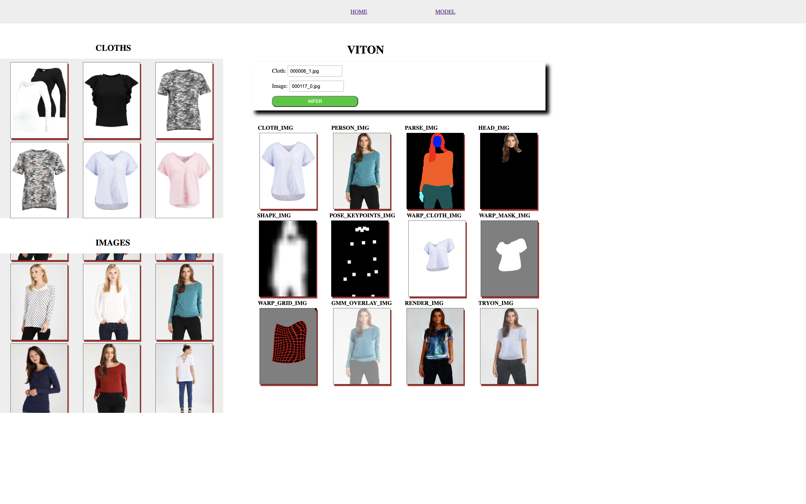

## Virtual Try On System

An web application that renders an image of a person fused with a cloth of their choice.
It is built to give user the experience of cloth **virtual try-on**.

Model training code be found in [this repo](https://github.com/rosxnb/viton).

The web app screenshot is attached show below:

